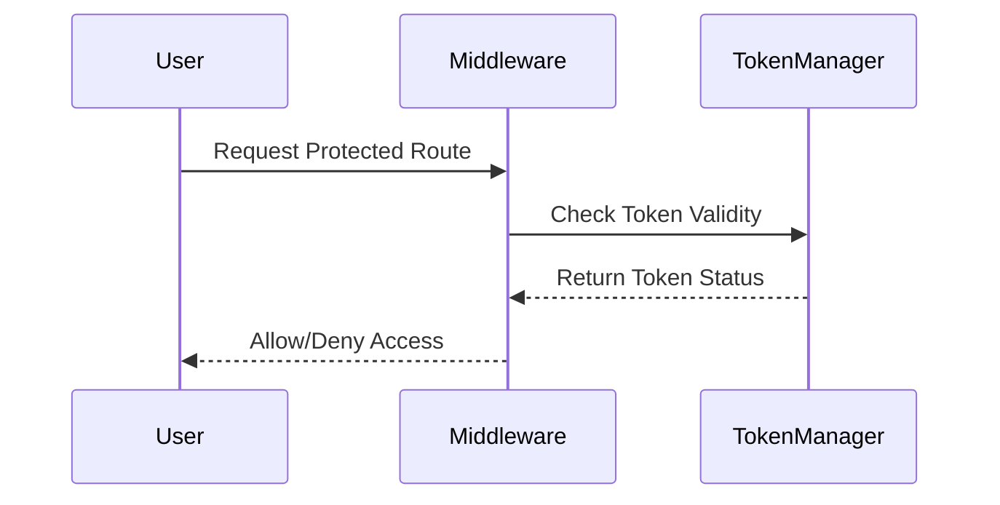
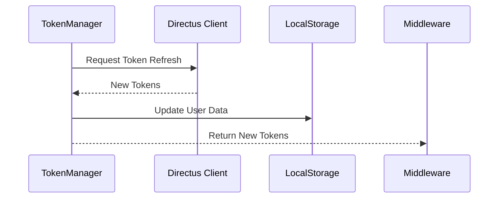

# Authentication Flow

## Overview

This document describes the authentication flow in our application, focusing on token management, user data persistence, and middleware protection.

## Components

### 1. TokenManager

The `TokenManager` is a singleton class responsible for:

- Managing access and refresh tokens
- Handling token refresh attempts
- Coordinating user data persistence
- Implementing retry logic for failed refreshes

### 2. Middleware

The middleware acts as a gatekeeper for protected routes by:

- Validating authentication tokens
- Coordinating with TokenManager for token validation
- Handling redirects for unauthenticated users
- Managing protected route access

### 3. Directus Client

Our API client that:

- Handles communication with the Directus backend
- Manages token refresh requests
- Provides authentication-related API calls

## Authentication Flow

### Initial Request



1. User attempts to access a protected route
2. Middleware intercepts the request
3. TokenManager validates the current tokens
4. Based on token validity, access is granted or denied

### Token Refresh Process



When the access token is invalid:

1. TokenManager initiates a refresh attempt
2. Directus Client processes the refresh request
3. On success:
   - New tokens are stored
   - User data is preserved
   - Access is granted
4. On failure:
   - User data is cleared
   - User is redirected to login

### Error Handling

The system implements robust error handling:

- Maximum of 3 refresh attempts
- Graceful degradation on failures
- Clear user feedback through redirects
- Proper cleanup of invalid sessions

## User Data Management

### Persistence Strategy

- User data is stored in localStorage
- Data is only cleared after confirmed authentication failure
- Automatic rehydration on successful token refresh

### Data Security

- Tokens are stored in HTTP-only cookies
- User data is minimal (first name, last name, email)
- Automatic cleanup on authentication failures

## Best Practices

### Token Management

- Access tokens have short expiration (2 minutes)
- Refresh tokens have longer expiration (1 day)
- Automatic token refresh before expiration
- Proper cleanup of expired tokens

### Error Recovery

- Graceful handling of network failures
- Clear user feedback on authentication issues
- Automatic redirect to login when needed
- Prevention of infinite refresh loops

## Implementation Notes

### TokenManager Configuration

```typescript
class TokenManager {
  private readonly MAX_REFRESH_ATTEMPTS = 3;
  private refreshAttempts = 0;
  private isRefreshing = false;
}
```

## Security Considerations

1. **Token Storage**

   - Access tokens in HTTP-only cookies
   - Refresh tokens in secure cookies
   - Minimal user data in localStorage

2. **Token Expiration**

   - Short-lived access tokens
   - Longer-lived refresh tokens
   - Automatic cleanup of expired tokens

3. **Error Handling**
   - Maximum refresh attempts
   - Secure session termination
   - Clear user feedback

## Troubleshooting

Common issues and solutions:

1. **Infinite Refresh Loop**

   - Check MAX_REFRESH_ATTEMPTS
   - Verify token expiration times
   - Monitor refresh attempt counter

2. **User Data Persistence**

   - Verify localStorage operations
   - Check token refresh success
   - Monitor user data updates

3. **Authentication Failures**
   - Check network connectivity
   - Verify token validity
   - Monitor refresh attempts
